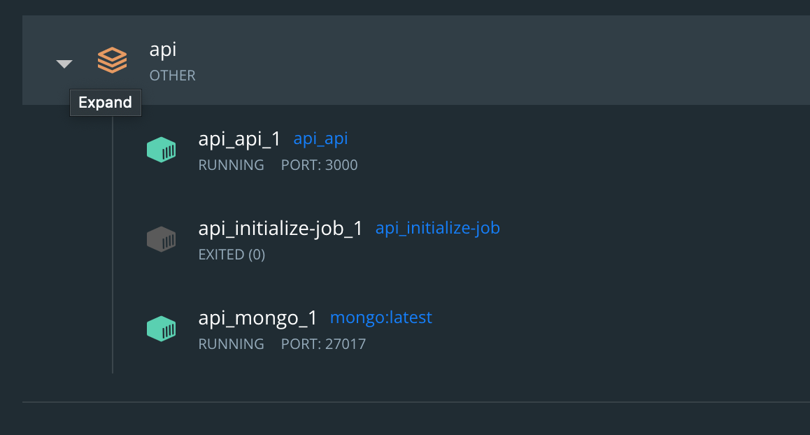

# IOTA Programming Assignment

This assignment has two applications: signer and verifier. 
## Signer
Signer takes username, NFT username and NFT (for this assignment, a very simple JSON document [nft_example.json](./nft_example.json) is used as a placeholder NFT), and creates a DID for the artist and a IFPS hash links to the signed credential.

## Verifier
Verifier takes the IPFS hashes of two NFT credentials, checks if the credentials can be  authenticated, and compare their issuance date to verify which NFT credential was issued earlier.

## Architecture
General architecture of the solution is illustrated in the diagram below.


## Installation and Configuration

Use [npm](https://www.npmjs.com/) to install the package.

```bash
npm install 
```
This implementation uses a [local docker-compose](https://wiki.iota.org/integration-services/getting_started/installation/docker_compose) setup for the IOTA Integration Service API. See [config.ts](./config.ts)



## Usage

```bash
# Run createSignerIdentity.ts to create a 
# signerIdentity.json file, which will be 
# used by signer.js 

npm run createSignerIdentity

# Run signer.js app

npm run signer

# Run verifier.js app

npm run verifier
```
Both applications run at [http://localhost:3001/](http://localhost:3001/) by default.

## Screenshots


